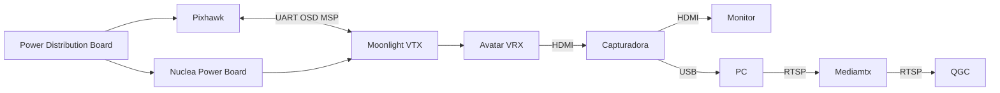

# Pruebas de vuelo

Registro de las pruebas de vuelo que se realizan cada semana

---

## 06 - Mar - 2025


---

## 13 - Mar - 2025

- @jeduardofr: Build para la AppImage de la version modificada de QGC aunque no se probo debido a
 errores de dependencias
- @jeduardofr: Probar vuelo remoto con mavproxy con dron anclado al suelo, salieron varios detalles
 como que el dron parecia "perder" el control y se aceleraba por su cuenta sin recibir los comandos.
 La teoria esta en que es debido a como esta anclado el suelo y como el sistema de control reacciona.
 Sigue pendiente hacer la prueba con el dron ya en vuelo normal.
- @fairbrook: Hacer prueba con video con un servidor de video remoto. La prueba fue exitosa.
La dirección del servidor es: `http://159.54.131.60:8889/comma/` para webrtc 
y `rtsp://159.54.131.60:8554/comma/` para rtsp (util en qground) 
__!!! Estas direcciones van a cambiar en el futuro !!!__
- @fairbrook y @jeduardofr: Validación de connexión mediante red celular.
La comma no detectaba la tarjeta SIM, el modem no detectaba la SIM. 
El problema fue que el puerto SIM estaba dañado, al revisar a detalle, uno de los
pines del puerto estaba doblado y no hacía contacto correctamente.
Por lo que la solución fue doblar de vuelta a posición el pin y se corregieron los problemas.
Al finalizar la prueba fue exitosa.
Comando útiles para el módulo SIM:

```bash
mmcli -M # Escaneo de modems
mmcli -L # Lista de modems disponibles
mmcli -m 0 # Mostrar información del modem 0
mmcli -m 0 --messaging-create-sms="number=+523323191926,text='hola'" # Enviar sms a un numero
mmcli -m --messaging-list-sms # Listar sms (recibidos y enviados)
mmcli -m 0 -s 0 # Mostrar información del mensaje 0
mmcli -m 0 -s 0 --send # Enviar sms 0
```

---

## 20 - Mar - 2025

Este día fue mucho trabajo en equipo para hacer la prueba de vuelo con el dron 
anclado al suelo.

- Configuración de sistema de poleas y cuerdas para mantener al dron dento de 
un rango de movimiento seguro
- Prueba de vuelo exitosa con el sistema de poleas para prevenir caidas del dron al
activar el "kill switch"
- Prueba de vuelo exitosa con el sistema de cuerdas para prevenir colisiones
con paredes, objetos y personas
- Prueba de vuelo exitosa con el control remoto. Utilizando dos equipos 
(mavproxy y QGC) y mando de xbox. _El fallo de la semana anterior fue que el
dron no tenía espacio de movimiento en el eje Z_

---

## 24 - Mar - 2025

Plan de conexión para la cámara FPV. El diagrma a continuación ejemplifica las
interacciones entre los distintos componentees del sistema que permitiría la
visualización de la cámara 
[Moonlight](https://caddxfpv.com/products/walksnail-moonlight-kit?variant=47701308997934)
en QGC y de forma remota en cualquier
dispositivo




## 25 - Mar -2025

- @fairbrook: Hacer prueba con video con un servidor de video remoto. La prueba fue exitosa.
Uitilizando OBS y WHIP se pudo hacer una transmisión de video con alta calidad y latencia
muy baja ~330ms. Al intentar hacer la transmisión de video utilizando el kit de
desarrollo Jetson Nano, la calidad fue menor y con una latencia de ~1.3s. Por lo
que se busca desarrollar un programa que permita la transmisión de video en la 
paltaforma Jetson Nano al utilizar "Hardware Encoding" y WHIP

---

## 01 - Abr - 2025

@fairbrook: Pruebas de latencia con video receptor y transmisor montado en dron y en estación de trabajo. Latencia aproximada de 800ms
@jeduardofr: Pruebas de vuelo remoto usando puro video (sin observar el dron) con version modificada de joystick (yaw, pitch & roll factors)

## 12 - Abr - 2025

@jeduardofr: Configuracion del sensor optico para mejor lectura de distancia vertical (altura). Mantenimiento
general del dron.

## 08 - May - 2025

@fairbrook: Configuración de antenas de telemetría P900

## 09 - May - 2025

@fairbrook: pruebas de vuelo y recalibracion del dron


## 12 - May - 2025

@fairbrook: Recorrido por c5 Jalisco 


## 15 - May - 2025

@fairbrook: Montar y configurar cámaras para el laboratorios de drones 

## 29 - May - 2025

@jeduardofr y @fairbrook: Debuggear posibles errores del driver de linux para el 
Modulo Sierra EM7455. Pruebas de vuelo con nueva version del sistema de refrigeracion,
siguientes mejoras seria dejar los puertos usb mas expuestos para facilitar su uso.
A


## 19 - Jun - 2025

@Fairbrook y @jeduardofr: Debuggear posibles errores con la camara Intel Realsense D435I
en la Jetson. Se intento compilando distintas versiones (2.51.1, beta mas reciente a la fecha)
y ninguna termino de funcionar. Lo ultimo que se intento fue alrededor de las reglas de udev.
Se reviso en windows y se actualizo el firmware de la camara (aunque no hacia falta) y todo
funcionaba bien con la camara.

## 20 - Jun - 2025

@Fairbrook y @jeduardofr: Instalacion de cable de ethernet para laboratorio de covenant.
Debuggear camara zed con la Jetson Orin Nano. Definir prioridades para el siguiente
viernes.

## 26 - Jun - 2025

@Fairbrook y @jeduardofr: Debuggear conexion de jetson con pixhawk (sin mucho exito).
@RodriSebas y @jeduardofr: Montar jetson junta con la camara zed (con exito).

## 03 - Jul - 2025

@Fairbrook: Creación de contenedores con Isaac sim

## 04 - Jul - 2025

@jeduardofr: Configuracion de red con Zerotier, comenzar migracion de isaac sim/pegasus 4.2 a 4.5.

## 07 - Ago - 2025

@jeduardofr: Pruebas DJI Dock, apoyar a Rodrigo con lerobot Setup en Gaia.


## 14 - Ago - 2025

@fairbrook: Pruebas de don DJI MAVIC 400. corrección de error de cámara P1 app actualizar firmware
@jeduardofr: Pruebas de vuelo con DJI DOCK 2

## 21 - Ago - 2025

@jeduardofr: Pruebas de vuelo con DJI Dock 3
@fairbrook: control del matice 4td con control

## 26 - Ago - 2025

@jeduardofr: Capacitación de DJI Dock 3 y Matrice 400

## 27 - Ago - 2025

@jeduardofr: Capacitación de DJI Terra

## 28 - Ago - 2025

@jeduardofr y @Fairbrook: Pruebas de PWM con servo externo exitosas.
@jeduardofr: Demo para estudiantes del TEC de forma remota con DJI Flighthub II.

## 04 - Sep - 2025

@jeduardofr y @Fairbrook: Instalacion de Gaia con Proxmox


## 05 - SEP - 2025

revisión y envío de TD P

## 11 - SEP - 2025

GPU passthrough en proxmox

## 18 - SEP - 2025

Estación del dron

## 24 - SEP - 2025

@Manuelo247: Se estuvo en la oficina. Se ayudo a Rodrigo en el inventariado y la base de datos. 

## 26 - SEP - 2025

@jeduardofr, @Fairbrook y @Manuelo247: pruebas con cámara Zenmuse L2. 
pruebas de vuelo
